<div align="center">


<br/>
<br/>

[](https://nextjs.org/)
[](https://vercel.com/)
[](https://supabase.com/)
[](https://airtable.com/)
[](https://n8n.io/)
[](https://openrouter.ai/)
[](https://drive.google.com/)
[](https://outlook.com/)

<br/>

[](https://opensource.org/licenses/MIT)
[]()
[]()
[]()

<br/>

# AkıllıSınıf AI

### *Akademik sınıf yönetimini veri ve yapay zekâ ile güçlendirin.*

Öğretmenlerin sınıf oluşturmasını, öğrencilerin sınıf koduyla katılmasını, akademik verilerin takip edilmesini, mesajlaşma ve bildirim akışlarının yönetilmesini ve riskli öğrenciler için erken destek kararlarının alınmasını sağlayan modern bir eğitim teknolojisi platformu.

<br/>

**[➜ Canlı Demo: akillisinif-ai.vercel.app](https://akillisinif-ai.vercel.app/)** &nbsp;·&nbsp; Hemen kullanmaya başla — ücretsiz

<br/>

---

</div>

## Ekran Görüntüleri

<table>
<tr>
<td width="50%">

### Ana Sayfa
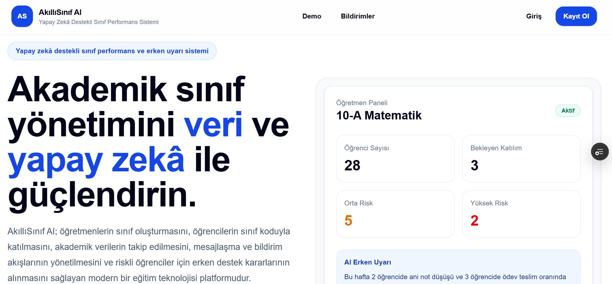
*Öğretmen paneli önizlemesi ile yapay zekâ erken uyarı sistemi*

</td>
<td width="50%">

### Özellikler
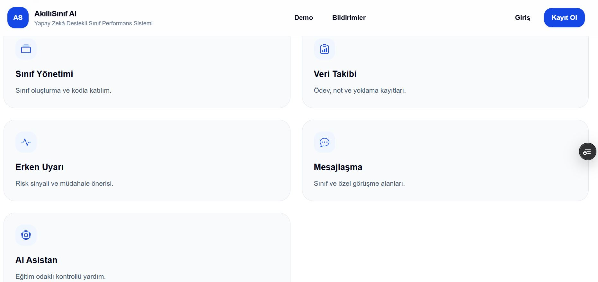
*Sınıf Yönetimi · Veri Takibi · Erken Uyarı · Mesajlaşma · AI Asistan*

</td>
</tr>
<tr>
<td width="50%">

### Giriş (Supabase Auth)
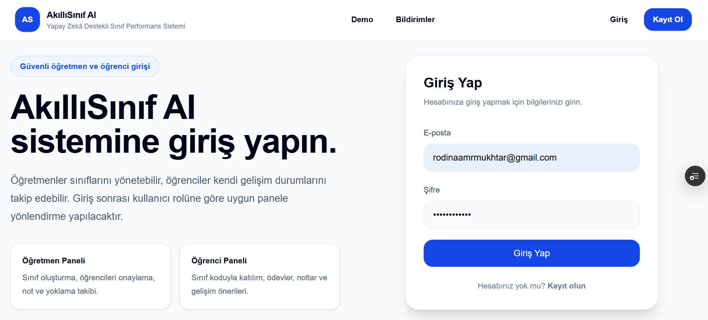
*Rol tabanlı güvenli kimlik doğrulama — giriş sonrası otomatik yönlendirme*

</td>
<td width="50%">

### Kayıt Ol
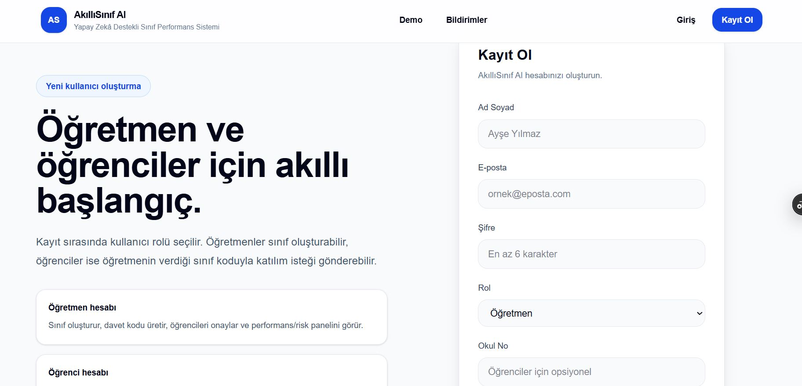
*Öğretmen veya öğrenci rolü seçerek kayıt — okul numarası opsiyonel*

</td>
</tr>
<tr>
<td width="50%">

### Öğretmen Paneli
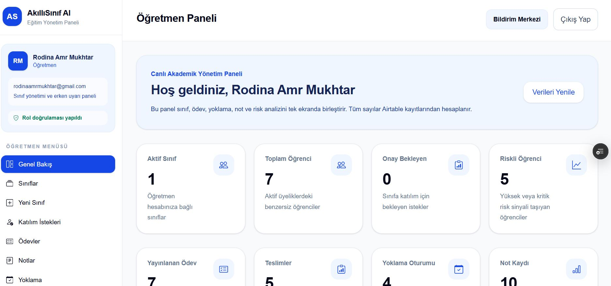
*Aktif sınıf · Toplam öğrenci · Onay bekleyen · Riskli öğrenci istatistikleri*

</td>
<td width="50%">

### Sınıf Detayı & Davet Kodu
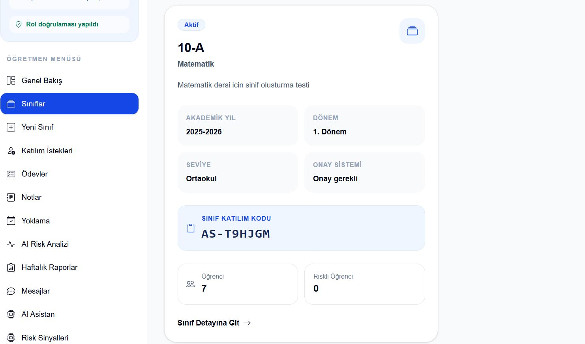
*Sınıf katılım kodu, öğrenci sayısı ve risk metrikleri tek ekranda*

</td>
</tr>
<tr>
<td width="50%">

### QR Kod ile Yoklama
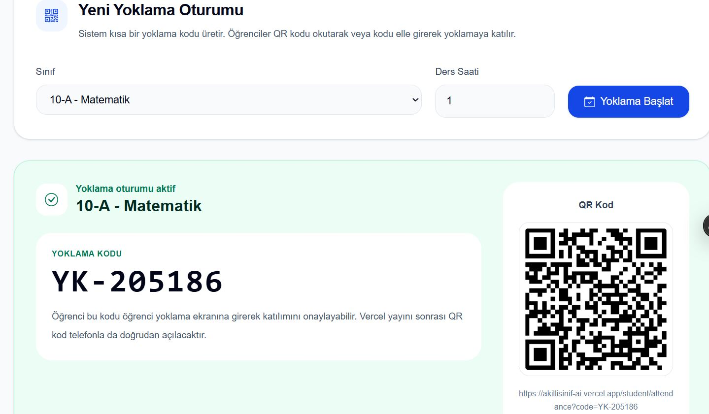
*Anında QR kod üretimi — öğrenciler telefonla tarayarak veya kodu girerek katılır*

</td>
<td width="50%">

### AI Karar Destek Asistanı
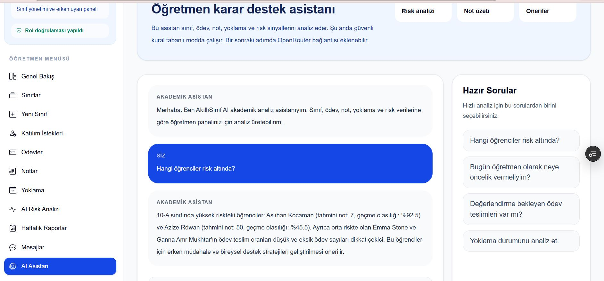
*"Hangi öğrenciler risk altında?" — gerçek zamanlı AI analizi*

</td>
</tr>
</table>

---

## Özellikler

<table>
<tr>
<td width="50%">

### Öğretmen

- **Sınıf Yönetimi** — Sınıf oluştur, davet kodu üret, katılım isteklerini onayla
- **Ödev & Not Takibi** — Ödev yayınla, teslimleri gör, not girişi yap
- **QR Yoklama** — Tek tıkla oturum aç; öğrenciler QR veya kod ile katılır
- **AI Risk Analizi** — Yüksek / orta / düşük risk sınıflandırması
- **Haftalık Raporlar** — Öğrenci ve sınıf bazında otomatik AI özetleri
- **AI Asistan** — Doğal dil ile anlık akademik analiz ve karar desteği
- **Mesajlaşma** — Sınıf geneli ve özel mesajlaşma kanalları
- **Bildirim Merkezi** — Uygulama içi ve e-posta bildirimleri

</td>
<td width="50%">

### Öğrenci

- **Kod ile Katıl** — Öğretmenin verdiği davet koduyla sınıfa katılım isteği gönder
- **Ödev Portalı** — Görevleri gör, dosya yükle, son tarihleri takip et
- **Not Görünümü** — Yayınlanan notları ve geri bildirimleri incele
- **Yoklama** — QR veya kod tabanlı öz denetim
- **Gelişim Özeti** — AI tarafından haftalık üretilen kişisel ilerleme raporu

</td>
</tr>
</table>

---

## Teknoloji Yığını

| Katman | Teknoloji | Açıklama |
|--------|-----------|----------|
| **Frontend** | Next.js + React | Vercel üzerinde deploy edilmiş |
| **Kimlik Doğrulama** | Supabase Auth | E-posta/şifre, rol tabanlı oturumlar |
| **Veritabanı** | Airtable | `AkilliSinif_AI_Veritabani` ilişkisel tabanı |
| **Otomasyon** | n8n | 13 zamanlanmış & webhook tetiklemeli workflow |
| **Yapay Zekâ** | OpenRouter API | GPT-4 / Claude modelleri |
| **Dosya Depolama** | Google Drive | n8n üzerinden ödev arşivi |
| **E-posta** | Microsoft Outlook | n8n entegrasyonu |

---

## Kimlik Doğrulama — Supabase

Kullanıcı kimlik doğrulama tamamen **Supabase Auth** ile yönetilir. Kayıt sırasında her kullanıcıya bir Supabase `Auth_ID` (UUID) atanır; bu değer Airtable'daki `Kullanicilar` tablosunda saklanarak kimliği akademik kayıtlara bağlar.

```
Supabase Auth  ──►  Auth_ID (UUID)  ──►  Airtable Kullanicilar tablosu
```

**Roller:**

| Rol | Yetkiler |
|-----|---------|
| `Ogretmen` | Sınıf oluşturma, öğrenci onaylama, tüm akademik verileri yönetme, AI risk paneli |
| `Ogrenci` | Kod ile sınıfa katılma, kendi verilerini görme, ödev gönderme, yoklamaya katılma |

Giriş sonrası uygulama, kullanıcıyı rolüne göre otomatik olarak doğru panele yönlendirir.

**Gerekli ortam değişkenleri:**
```env
NEXT_PUBLIC_SUPABASE_URL=your_supabase_project_url
NEXT_PUBLIC_SUPABASE_ANON_KEY=your_supabase_anon_key
```

---

## Veritabanı Şeması (Airtable)

`AkilliSinif_AI_Veritabani` Airtable tabanı şu tabloları içerir:

<table>
<tr><th>Tablo</th><th>Açıklama</th></tr>
<tr><td><code>Kullanicilar</code></td><td>Auth_ID (Supabase), ad soyad, e-posta, rol, okul numarası</td></tr>
<tr><td><code>Siniflar</code></td><td>Sınıf adı, ders, öğretmen, akademik yıl, dönem</td></tr>
<tr><td><code>Davet_Kodlari</code></td><td>Her sınıf için üretilen davet kodları</td></tr>
<tr><td><code>Sinif_Uyelikleri</code></td><td>Öğrenci–sınıf bağlantısı, onay durumu</td></tr>
<tr><td><code>Konular</code></td><td>Sınıf başına ders konuları</td></tr>
<tr><td><code>Duyurular</code></td><td>Sınıf duyuruları</td></tr>
<tr><td><code>Odevler</code></td><td>Ödev başlığı, son tarih, bağlı sınıf</td></tr>
<tr><td><code>Odev_Teslimleri</code></td><td>Dosya ekleri, teslim zaman damgaları</td></tr>
<tr><td><code>Notlar</code></td><td>Öğrenci, sınıf ve ödev bağlantılı not kayıtları</td></tr>
<tr><td><code>Yoklamalar</code></td><td>Yoklama oturumları ve öğrenci bazında kayıtlar</td></tr>
<tr><td><code>Ogrenci_Ozetleri</code></td><td>AI tarafından haftalık üretilen öğrenci özetleri</td></tr>
<tr><td><code>Risk_Sinyalleri</code></td><td>YÜKSEK / ORTA / DÜŞÜK risk sınıflandırması ve gerekçesi</td></tr>
<tr><td><code>Tahminler</code></td><td>Öğrenci başına AI performans tahminleri</td></tr>
<tr><td><code>Mudahale_Planlari</code></td><td>Yüksek riskli öğrenciler için müdahale planları</td></tr>
<tr><td><code>Mudahale_Adimlari</code></td><td>Adım adım müdahale eylem maddeleri</td></tr>
<tr><td><code>Bildirimler</code></td><td>Uygulama içi bildirim günlüğü</td></tr>
<tr><td><code>Haftalik_Raporlar</code></td><td>AI tarafından üretilen haftalık öğretmen raporları</td></tr>
</table>

| Kullanıcılar | Sınıflar | Tahminler |
|---|---|---|
| 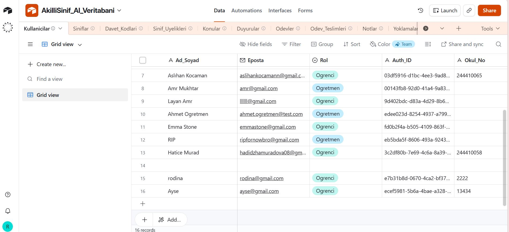 | 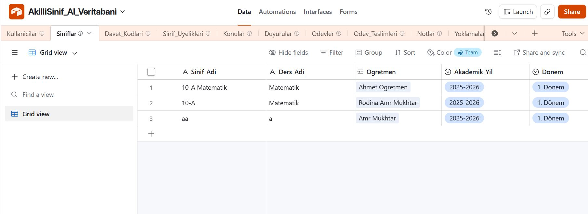 | 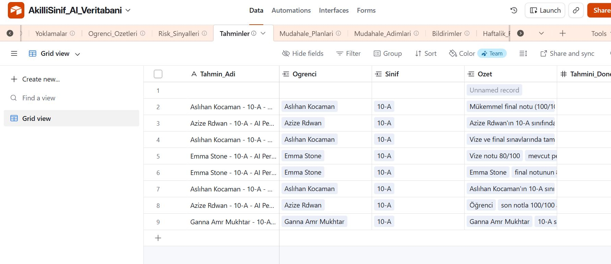 |
| *Auth_ID ile Supabase bağlantısı* | *Sınıf kayıtları, öğretmen ve dönem bilgisi* | *AI tahmin özetleri öğrenci bazında* |

---

## n8n Otomasyon Workflow'ları

> 13 adet zamanlanmış veya webhook tetiklemeli workflow — Airtable ve OpenRouter AI ile tam entegre.

<details>
<summary><b>Workflow 01 — Haftalık AI Risk Raporu Oluştur ve Kaydet</b></summary>

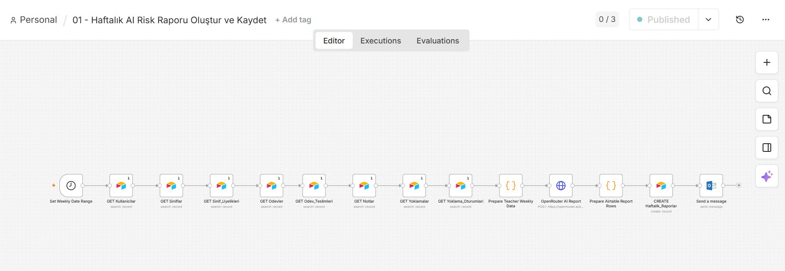

Haftalık olarak tüm öğrenci verilerini (notlar, yoklama, teslimler) toplar, OpenRouter AI'a gönderir ve üretilen risk raporunu Airtable'a kaydeder. Öğretmenlere Outlook üzerinden özet gönderir.

</details>

<details>
<summary><b>Workflow 02 — Ödev Teslim Hatırlatma ve E-posta Bildirimi</b></summary>

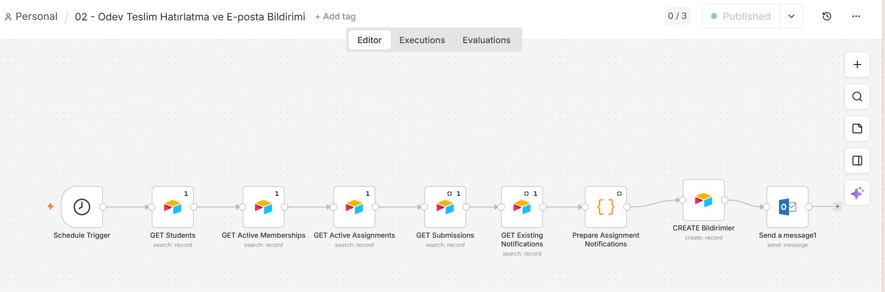

Yaklaşan ödev son tarihlerini kontrol eder, henüz teslim etmemiş öğrencileri tespit eder ve Outlook üzerinden hatırlatma e-postası gönderir.

</details>

<details>
<summary><b>Workflow 03 — Yoklama Devamsızlık Uyarısı ve E-posta Bildirimi</b></summary>

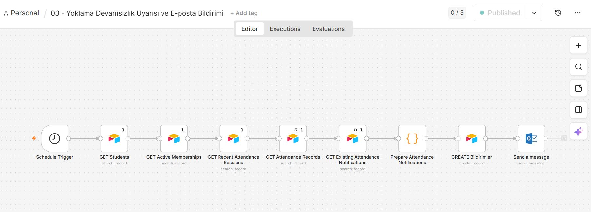

Son yoklama oturumlarında yüksek devamsızlık oranına sahip öğrencileri saptar ve otomatik e-posta uyarısı gönderir.

</details>

<details>
<summary><b>Workflow 04 — Katılım İsteği Öğretmen Bildirimi ve E-posta</b></summary>

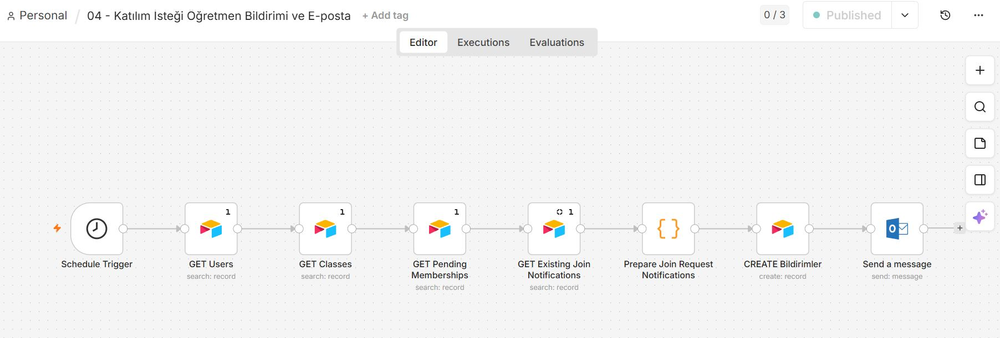

Bekleyen sınıf katılım isteklerini izler ve öğrenciler onay beklediğinde öğretmenleri e-posta ile bilgilendirir.

</details>

<details>
<summary><b>Workflow 05 — Not İlan Edildi Öğrenci Bildirimi ve E-posta</b></summary>

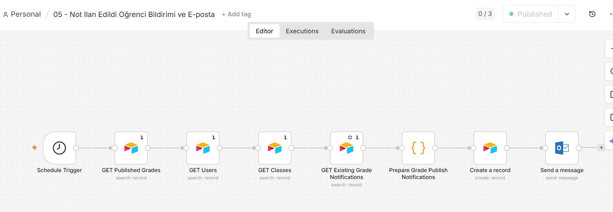

Yeni yayınlanan notları tespit eder ve etkilenen her öğrenciye kişiselleştirilmiş e-posta bildirimi gönderir.

</details>

<details>
<summary><b>Workflow 06 — AI Performans Tahmini Oluşturma ve Kaydetme</b></summary>

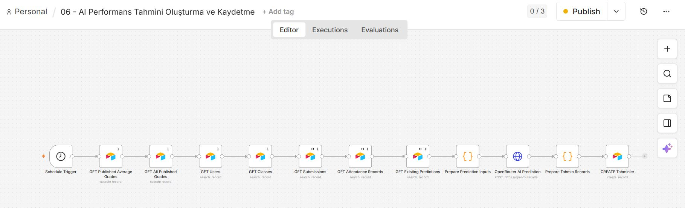

Not ortalamaları, teslim verileri ve yoklama kayıtlarını toplar; ardından her öğrenci için OpenRouter AI'dan performans tahmini üretir ve Airtable'a kaydeder.

</details>

<details>
<summary><b>Workflow 07 — Yüksek Risk Öğrenci Müdahale Planı Oluşturma</b></summary>

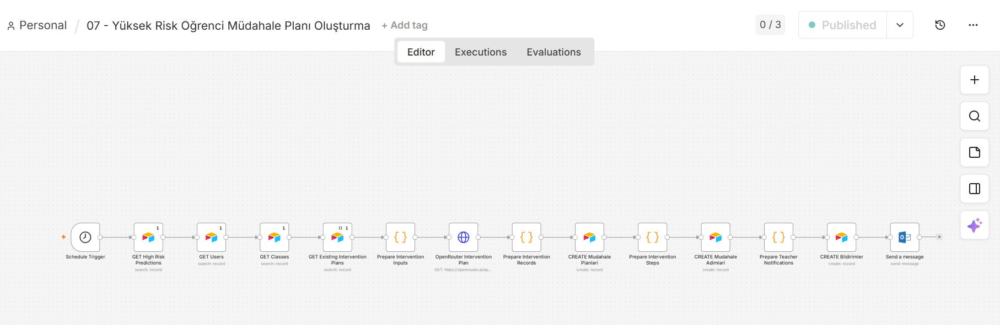

Yüksek riskli öğrenciler için OpenRouter aracılığıyla ayrıntılı, adım adım AI müdahale planı oluşturur; planı ve eylem adımlarını Airtable'a kaydeder. Öğretmeni e-posta ile bilgilendirir.

</details>

<details>
<summary><b>Workflow 08 — Haftalık Öğrenci Gelişim Özeti</b></summary>

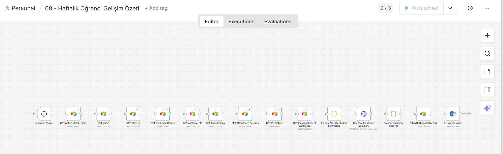

Her öğrenci için kapsamlı bir haftalık anlık görüntü (notlar, ödevler, yoklama, tahminler, risk sinyalleri) derler ve AI tarafından yazılmış bir özet üretir.

</details>

<details>
<summary><b>Workflow 09 — Sistem Denetim Kaydı ve Veri Kalite Kontrolü</b></summary>

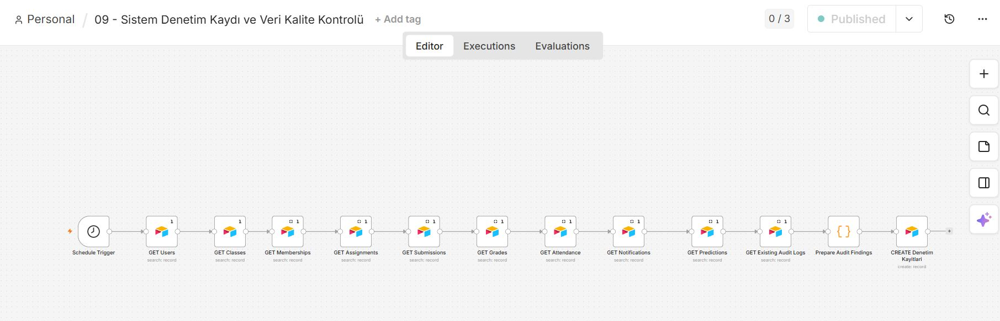

Tüm Airtable tablolarının tam denetimini yapar ve bir veri kalite raporu kaydeder.

</details>

<details>
<summary><b>Workflow 10 — AI Risk Sinyali Üretimi ve Öğretmen Uyarısı</b></summary>

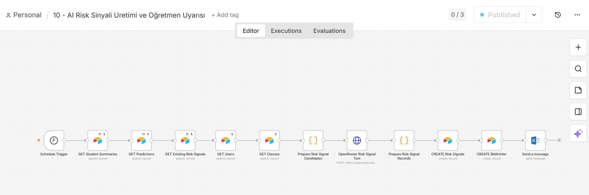

Mevcut öğrenci özetlerini ve tahminlerini okur, OpenRouter'dan risk seviyesini değerlendirmesini ve bir risk sinyali oluşturmasını ister, `Risk_Sinyalleri` tablosuna kaydeder ve öğretmeni derhal e-posta ile uyarır.

</details>

<details>
<summary><b>Workflow 11 — AI Asistan Webhook Cevap Sistemi</b></summary>

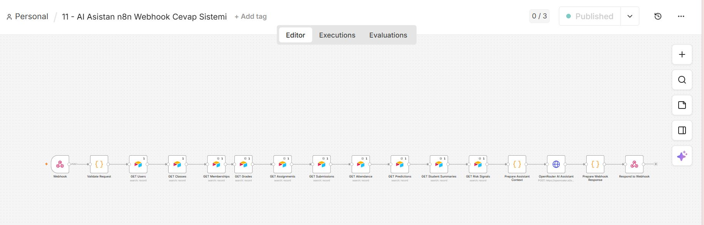

Uygulama içi AI asistanını destekleyen webhook tetiklemeli workflow. Bir sorgu alır, Airtable'dan tam öğrenci bağlamını çeker, OpenRouter'a gönderir ve bağlamsal bir yanıtı ön yüze döndürür.

</details>

<details>
<summary><b>Workflow 12 — AI Asistan Haftalık Ders ve Sınıf Önerileri</b></summary>

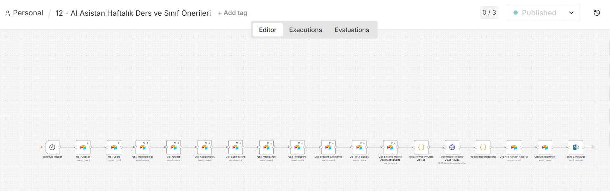

Mevcut öğrenci özetleri ve risk sinyallerine dayanarak sınıf başına haftalık AI destekli ders ve sınıf stratejisi önerileri üretir. Raporları kaydeder ve bildirim gönderir.

</details>

<details>
<summary><b>Workflow 13 — Ödev Dosyalarını Google Drive'a Arşivle</b></summary>

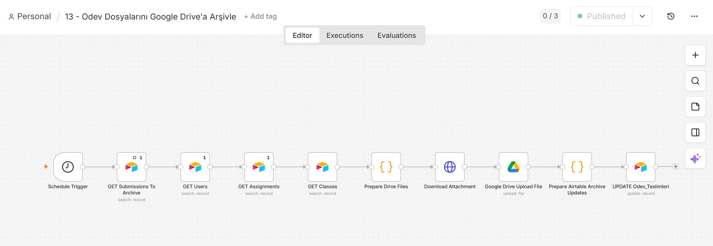

Airtable'daki teslim eklerini otomatik olarak indirir ve yapılandırılmış bir Google Drive klasörüne yükler, ardından teslim kaydını Drive arşiv bağlantısıyla günceller.

</details>

---

## Kurulum

### Gereksinimler

- Node.js 18+
- [Supabase](https://supabase.com/) projesi
- [Airtable](https://airtable.com/) tabanı (yukarıdaki şema)
- [n8n](https://n8n.io/) kurulumu (otomasyonlar için)
- [OpenRouter](https://openrouter.ai/) API anahtarı

### Kurulum Adımları

```bash
git clone https://github.com/kullanici-adiniz/akillisinif-ai.git
cd akillisinif-ai
npm install
```

### Ortam Değişkenleri

Proje kökünde `.env.local` dosyası oluşturun:

```env
# Supabase
NEXT_PUBLIC_SUPABASE_URL=https://your-project.supabase.co
NEXT_PUBLIC_SUPABASE_ANON_KEY=your-anon-key

# Airtable
AIRTABLE_API_KEY=your-airtable-api-key
AIRTABLE_BASE_ID=your-airtable-base-id

# OpenRouter (AI Asistan için)
OPENROUTER_API_KEY=your-openrouter-api-key

# n8n Webhook (AI Asistan — Workflow 11)
N8N_WEBHOOK_URL=https://your-n8n-instance/webhook/your-webhook-id
```

### Yerel Çalıştırma

```bash
npm run dev
```

Tarayıcıda [http://localhost:3000](http://localhost:3000) adresini açın.

### Vercel'e Deploy

```bash
npm install -g vercel
vercel --prod
```

Tüm ortam değişkenlerini Vercel panosunda **Settings → Environment Variables** altında tanımlayın.

---

## n8n Kurulumu

1. Workflow JSON dosyalarını `/n8n-workflows` klasöründen n8n örneğinize içe aktarın.
2. Airtable, Outlook ve Google Drive node'larını kendi kimlik bilgilerinizle bağlayın.
3. OpenRouter API anahtarınızı ilgili HTTP node'larına ekleyin.
4. Her workflow'u zamanlanmış tetikleyicisinde aktif edin.
5. Workflow 11'in webhook URL'sini `.env.local` dosyasına `N8N_WEBHOOK_URL` olarak ekleyin.

---

## Katkıda Bulunma

Pull request'ler memnuniyetle karşılanır. Büyük değişiklikler için lütfen önce bir issue açarak ne değiştirmek istediğinizi tartışın.

---

<div align="center">

**Lisans:** MIT &nbsp;·&nbsp; **Durum:** 🟢 Canlı

[](https://akillisinif-ai.vercel.app/)

*Eğitimi veriyle, kararları yapay zekâyla güçlendirin.*

</div>
